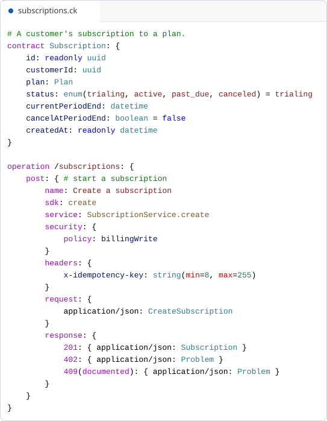
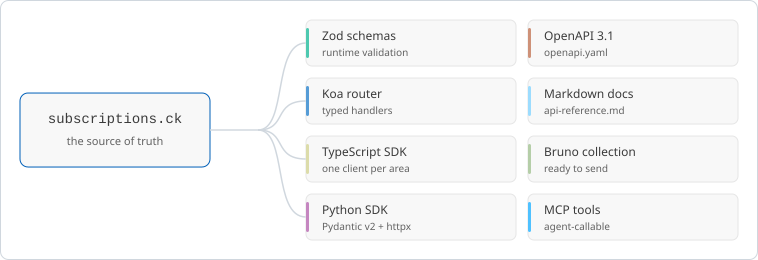
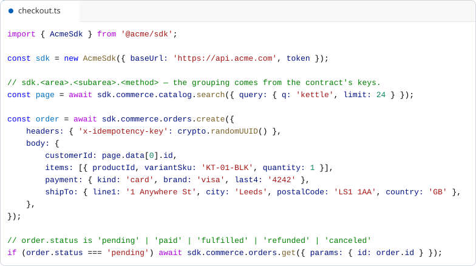
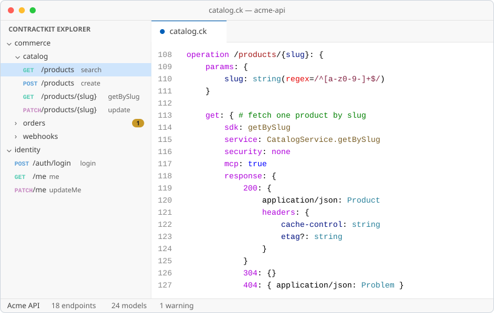
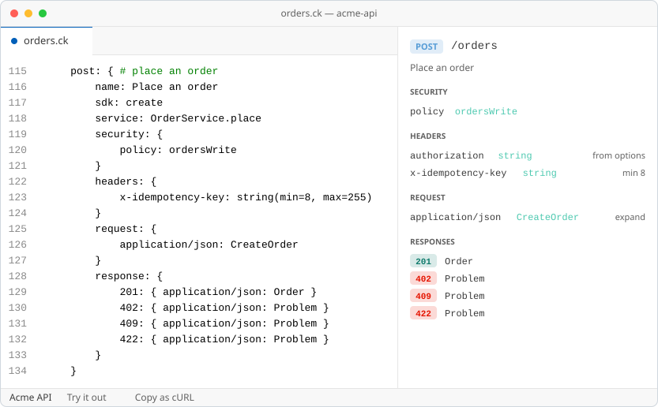
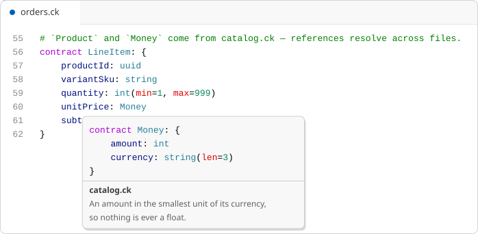
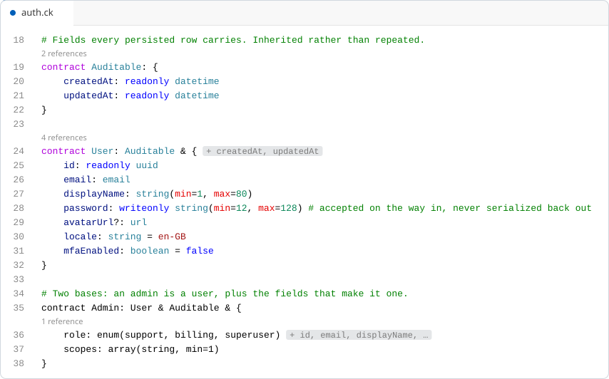
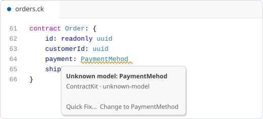
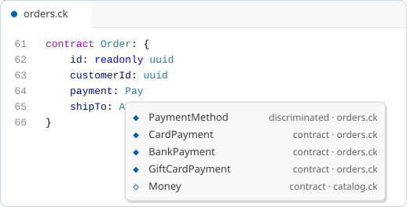

<div align="center">


**Describe your API once, in a file you can read aloud. Generate everything else.**

[Language reference](docs/language.md) · [Configuration](docs/config.md) · [Tooling](docs/tooling.md) · [Examples](contracts/examples)

</div>

---

An API is usually written down four or five times: the validation schemas, the router, the client
SDK, the OpenAPI spec, the docs. They agree on the day you write them and drift from each other
every day after.

ContractKit gives you one place to say it. A `.ck` file describes your models and your endpoints,
and the compiler produces the rest.

<picture>
  <source media="(prefers-color-scheme: dark)" srcset="assets/figures/hero-dark.svg">
  
</picture>

That file is the source of truth. Everything below is generated from it, and regenerated when it
changes.

<picture>
  <source media="(prefers-color-scheme: dark)" srcset="assets/figures/pipeline-dark.svg">
  
</picture>

Nothing is generated by a plugin you didn't ask for: the CLI only does discovery, caching and
formatting, and every artefact above comes from a plugin you list in your config.

## Quickstart

**1. Install the CLI and the plugins you want.**

```bash
pnpm add -D @contractkit/cli @contractkit/plugin-typescript
```

**2. Write a contract.** Save this as `contracts/billing.ck`:

```
options {
    keys: {
        area: billing
    }
    services: {
        PlanService: "#modules/billing/plan.service.js"
    }
}

contract Plan: {
    id: readonly uuid
    name: string(min=1, max=80)
    amountCents: int(min=0)
    interval: enum(month, year) = month
}

operation /plans: {
    get: { # list the plans on sale
        sdk: list
        service: PlanService.list
        query: {
            limit?: int(min=1, max=100) = 20
        }
        response: {
            200: { application/json: array(Plan) }
            401:
        }
    }
}
```

**3. Point the compiler at it.** Save this as `contractkit.config.json`:

```json
{
    "rootDir": ".",
    "patterns": ["contracts/**/*.ck"],
    "plugins": {
        "@contractkit/plugin-typescript": {
            "server": { "baseDir": "apps/api/", "zod": true },
            "sdk": { "baseDir": "packages/sdk/", "name": "myapp" }
        }
    }
}
```

**4. Compile.**

```bash
npx contractkit
```

| Flag | Effect |
| --- | --- |
| `-w`, `--watch` | Recompile on change |
| `-c`, `--config` | Use a specific config file (otherwise the CLI searches upward for `contractkit.config.json`) |
| `--force` | Ignore the incremental cache and recompile everything |

**5. Use what came out.** The SDK groups itself by the `area` and `subarea` keys in your contracts,
and its types come from the same declarations the server validates against:

<picture>
  <source media="(prefers-color-scheme: dark)" srcset="assets/figures/sdk-usage-dark.svg">
  
</picture>

Rename a field in the contract and this file stops compiling — which is the point.

## Real-world examples

The contracts in [`contracts/examples`](contracts/examples) are complete, realistic APIs rather
than snippets. They are compiled and validated as one project by the test suite, so they are safe
to copy from.

| Example | Shows |
| --- | --- |
| [`billing/subscriptions.ck`](contracts/examples/billing/subscriptions.ck) | Plans and subscriptions: constrained fields, defaults, idempotency headers, a documented-only `409`, and a PDF download alongside a JSON API |
| [`commerce/catalog.ck`](contracts/examples/commerce/catalog.ck) | A product catalog: public reads, cursor pagination, caching headers with a `304`, an inline patch body, and a search endpoint exposed to agents as an MCP tool |
| [`commerce/orders.ck`](contracts/examples/commerce/orders.ck) | Orders and refunds: a discriminated union over payment methods, nested inline objects, cross-file model references, and file-level request/response headers |
| [`commerce/webhooks.ck`](contracts/examples/commerce/webhooks.ck) | Inbound webhooks: HMAC signature verification, `security: none`, and `204` responses |
| [`identity/auth.ck`](contracts/examples/identity/auth.ck) | Sessions and users: multi-base inheritance, `readonly` / `writeonly` fields, per-route security policies, and an `internal` admin route |

## In your editor

The [VS Code extension](apps/vscode-extension) is a language server, not just a colour scheme. It
indexes every `.ck` file in the workspace, so it can answer questions across files.

<picture>
  <source media="(prefers-color-scheme: dark)" srcset="assets/figures/vscode-explorer-dark.svg">
  
</picture>

Click any endpoint and it opens a live preview of the request and response, refreshed as you type —
with a Try-it form that sends the request from the editor:

<picture>
  <source media="(prefers-color-scheme: dark)" srcset="assets/figures/vscode-preview-dark.svg">
  
</picture>

Hover a model to see where it is declared, even when that is another file:

<picture>
  <source media="(prefers-color-scheme: dark)" srcset="assets/figures/vscode-hover-dark.svg">
  
</picture>

Inlay hints spell out what a model inherits, and a reference count sits above every declaration:

<picture>
  <source media="(prefers-color-scheme: dark)" srcset="assets/figures/vscode-inlay-hints-dark.svg">
  
</picture>

Mistype a model name and the language server says so before you compile, with a quick fix:

<picture>
  <source media="(prefers-color-scheme: dark)" srcset="assets/figures/vscode-diagnostics-dark.svg">
  
</picture>

Completion knows the models in every indexed file, not just the open one:

<picture>
  <source media="(prefers-color-scheme: dark)" srcset="assets/figures/vscode-completion-dark.svg">
  
</picture>

There is also a [Prettier plugin](apps/prettier-plugin) for `.ck` files, so formatting is not a
thing anyone has to have an opinion about.

## Language cheat sheet

Every construct in the language, in one block. The [language reference](docs/language.md) explains
each one in depth.

```
# ─── File metadata (optional, one per file) ──────────────────────────────
options {
    keys: {
        area: billing                    # interpolated elsewhere as {{area}}
    }
    services: {
        PetService: "#modules/pet/pet.service.js"
    }
    request:  { headers: { x-request-id: string } }   # merged into every operation
    response: { headers: { x-trace-id: string } }
    security: { policy: authenticated }
}

# ─── Contracts ───────────────────────────────────────────────────────────
contract Pet: {                          # a model
    id: readonly uuid                    # readonly — dropped from Input variants
    secret: writeonly string             # writeonly — dropped from Output variants
    name: string(min=1, max=80)          # constraints
    tags?: array(string, min=1)          # optional
    owner: Person | null                 # nullable via union
    status: enum(available, sold) = available   # default
    legacy: deprecated string
    meta: record(string, json)
    pair: tuple(int, string)
    self: lazy(Pet)                      # self-reference
}

contract Admin: Person & Auditable & {   # multi-base inheritance
    role: string
}
contract Id: uuid                        # type alias
contract Shape: discriminated(by=kind, Circle, Square)

contract mode(loose) Loose: { a: string }             # unknown keys pass through
contract format(input=snake) Snake: { userId: int }   # wire casing

# ─── Operations ──────────────────────────────────────────────────────────
operation(internal) /pets/{id}: {        # internal | deprecated | public
    params: {
        id: uuid
    }
    security: { policy: petsWrite }      # or `security: none`

    get: { # doc comment
        name: Get a pet                  # human label for docs
        sdk: getPet                      # SDK method name
        service: PetService.getById      # handler binding
        mcp: { hint: readOnly }          # expose as an MCP tool
        signature: webhookKey            # HMAC-verified body

        query: {
            page?: int = 1
        }
        headers: {
            x-api-key: string
        }
        request: {
            application/json: PetInput
        }
        response: {
            200: {                       # has a block, or is 2xx => the service returns it
                image/png: binary        # several mimes: the service picks one
                image/jpeg: binary
                headers: {
                    etag?: string
                }
            }
            202: { application/json: JobRef }
            304: {}                      # empty block: returned, carries nothing
            404:                         # bare non-2xx: documented, reaches clients as an error
            409(documented): { application/json: Problem }   # declared, but not returned
        }
        plugins: {
            bruno: { folder: "Pets" }    # plugin values are JSON-typed
        }
    }
}
```

## Documentation

| Guide | Covers |
| --- | --- |
| [Language reference](docs/language.md) | Every `.ck` construct: contracts, fields, types, operations, responses, security, MCP, plugin extensions |
| [Configuration](docs/config.md) | `contractkit.config.json`, the built-in plugins and their options, writing your own plugin |
| [Tooling](docs/tooling.md) | SDK generation, docs generation, incremental compilation, cross-file validation, Prettier, the VS Code extension |

Per-package READMEs live under [`packages/`](packages) and [`apps/`](apps).
[`llms.txt`](llms.txt) is a machine-readable index of all of it.

## Packages

All packages publish under the `@contractkit` npm scope.

| Package | Purpose |
| --- | --- |
| [`@contractkit/cli`](apps/cli) | The `contractkit` binary — discovery, config, plugin orchestration |
| [`@contractkit/core`](packages/contractkit) | Grammar, parser, AST, semantics, validation, plugin interface |
| [`@contractkit/plugin-typescript`](packages/plugin-typescript) | Koa routers, TypeScript SDK, Zod schemas, plain types, MCP tools |
| [`@contractkit/plugin-python`](packages/plugin-python) | Python SDK (Pydantic v2 + httpx) |
| [`@contractkit/plugin-openapi`](packages/plugin-openapi) | OpenAPI 3.1 YAML |
| [`@contractkit/plugin-markdown`](packages/plugin-markdown) | Markdown API reference |
| [`@contractkit/plugin-bruno`](packages/plugin-bruno) | Bruno REST collection |
| [`@contractkit/openapi-to-ck`](packages/openapi-to-ck) | OpenAPI YAML → `.ck`, for adopting an existing API |
| [`@contractkit/explorer-ui`](packages/explorer-ui) | HTML renderer behind the VS Code API explorer |
| [`@contractkit/prettier-plugin`](apps/prettier-plugin) | Prettier plugin for `.ck` files |
| `@contractkit/vscode-extension` | VS Code / Cursor language support — LSP plus syntax highlighting ([source](apps/vscode-extension)) |

## Contributing

```bash
pnpm install
pnpm test
pnpm build
```

Scope to one package with `pnpm --filter @contractkit/core test`, or to a single file with
`pnpm --filter @contractkit/core exec vitest run tests/parser-ck.test.ts`.

Shared tooling config lives in the private `@repo/config-typescript` and `@repo/config-eslint`
packages, which every workspace extends. The figures in this README are generated — they are
rendered from the checked-in example contracts using the VS Code extension's own TextMate grammar,
so they cannot drift from the language:

```bash
pnpm docs:images
```

See [`packages/docs-images`](packages/docs-images) for how that works.

The compiler core is small enough to read in an afternoon:

```
packages/contractkit/src/
  contractkit.ohm             # Ohm PEG grammar — the source of truth for the language
  semantics.ts                # Parse tree → AST
  parser.ts                   # parseCk() entry point
  ast.ts                      # AST type definitions
  type-utils.ts               # Type ref collection, topo sort, input-model graph
  response-sets.ts            # Which responses are emitted / observable / thrown
  apply-options-defaults.ts   # Merges options-level header globals into operations
  apply-variable-substitution.ts  # Expands {{name}} references
  validate-refs.ts            # Cross-file type reference validation
  validate-inheritance.ts     # Multi-base inheritance validation
  validate-operation.ts       # Path parameter and operation validation
  plugin.ts                   # ContractKitPlugin / PluginContext interfaces
```

Both normalization passes run in the CLI between `parseCk` and `decomposeCk`, not inside the
parser — the Prettier plugin calls `parseCk` directly and needs the unmerged AST to round-trip a
file. Changing the grammar is never a one-file change; the checklist of what must move with it is
in `.claude/skills/ck-grammar-change/`.
